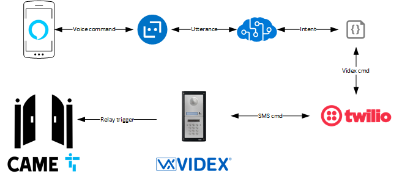

# VidexBot: Smart Home Gate Automation


[Bot Framework chatbot](https://dev.botframework.com) for controlling door or gate automation - using the [Videx](https://www.videxuk.com) [GSM series](https://www.videxuk.com/system/digital-gsm-intercom-system/) intercom.

Handling the ability to automate:
  - Gate opening
  - Gate closing
  - Gate latching
  - Checking credit balance

Example interaction, gate opening

- User: "Alexa, ask security to open the gates"
- Alexa: "What is the magic word?"
- User: "mushrooms"
- Alexa: "Opening gates.."

## Software components

- [LUIS](https://www.luis.ai) for natural language understanding
- [Alexa - Bot Framework Channel](https://docs.microsoft.com/en-us/azure/bot-service/bot-service-channel-connect-alexa?view=azure-bot-service-4.0) for seamless integration from Alexa enabled devices
- [Twilio](https://twilio.com) Programmable SMS


## Hardware components

- Alexa device
- Videx GSM Series intercom
- Came gate controller (optional)

### Overview

Voice input is received via an Alexa device (other supported Bot Framework channels can also be used). Alexa performs the speech to text, and the raw text is parsed by LUIS to understand the user's intent.  

The [VidexClient.cs](src/Helpers/VidexClient.cs) creates the corresponding SMS Videx command for the intent. This SMS is sent to the Twilio API to handle the integration over a cellular network.

When the SMS is received by the Videx GSM intercom it will immediately execute the command. If the command is to open/latch/close the gates, the relay on the CAME gate controller is then open/closed.

When opening the gates, the chatbot will prompt the user to say a magic word (passphrase). This isn't meant to be a secure solution, this is more for an additional verfication check and fun.

If the issuing command has a response (ie. check balance), the response message will be sent to the registered Twilio account phone number and invoke a webhook.  This is received on the [SMSController.cs](src/Controllers/SMSController.cs) and handled as a pro-active message back to the user. 

Note: Currently, pro-active messages are not supported by Alexa - this isn't a limitation of the Bot Framework or the Azure Bot Service Alexa Channel, but due to the restricted notification protocol of Alexa Skills.

## Architecture



### Configuration

Ensure the following configuration values are set

```json
  "MicrosoftAppId": "Bot Framework Application Id",
  "MicrosoftAppPassword": "Bot Framework Application password",
  "LuisAppId": "LUIS Application Id",
  "LuisAPIKey": "LUIS API key",
  "LuisAPIHostName": "LUIS region endpoint",
  "TwilioSID": "Twilio Id",
  "TwilioAuthToken": "Twilio authentication token",
  "TwilioSMSNumber": "Twilio SMS number (sender)",
  "VidexSMSNumber": "Videx SMS number (receiver)",
  "VidexPin": "Videx GSM pin code",
  "Passphrase": "Magic word to open the gates"
```

### LUIS Language understanding model

The LUIS model which handles the different intents is [VidexBot.json](src/LUIS/VidexBot.json). Here you can customise what utterances you want to support.

### Twilio Programmable SMS

A Twilio account and a Progammable SMS telephone number is required.  For pro-active message responses back from the Videx GSM intercom, you'll need to configure the Twilio phone number messaging webhook [TwiML App](https://www.twilio.com/console/phone-numbers) with a messaging webhook for when "a message comes in" eg:


### Alexa Skill

In order for this to be invoked via Alexa, you'll need to create an Alexa Skill.  This is simple to do, just follow the instructions here: https://docs.microsoft.com/en-us/azure/bot-service/bot-service-channel-connect-alexa?view=azure-bot-service-4.0.  Choose an invocation name that best fits the implementation, for example you might prefer to use the name/number of your house/flat.  Or use a more generic term like `gates`/`front door`/`security`.

As an example, the Alexa Skill raw json I've used is below:

```json
{
"interactionModel": {
    "languageModel": {
        "invocationName": "security",
        "intents": [
            {
                "name": "GetUserIntent",
                "slots": [
                    {
                        "name": "phrase",
                        "type": "phrase"
                    }
                ],
                "samples": [
                    "{phrase}"
                ]
            },
            {
                "name": "AMAZON.StopIntent",
                "samples": []
            },
            {
                "name": "AMAZON.NavigateHomeIntent",
                "samples": []
            }
        ],
        "types": [
            {
                "name": "phrase",
                "values": [
                    {
                        "name": {
                            "value": "open gates"
                        }
                    },
                    {
                        "name": {
                            "value": "close gates"
                        }
                    },
                    {
                        "name": {
                            "value": "latch gates"
                        }
                    }
                ]
            }
        ]
    }
}
}

```